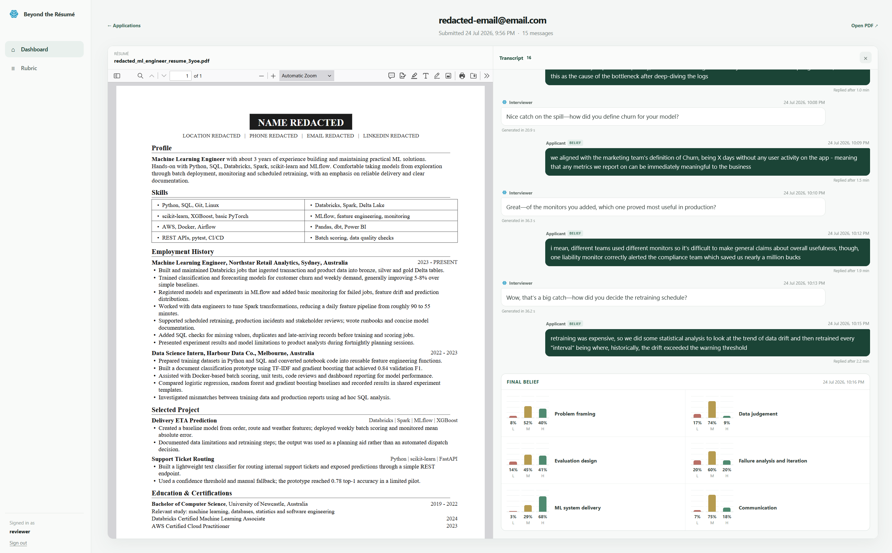

# Beyond the Resume: A Rubric-Aware Automatic Interview System for Information Elicitation



## Abstract

> Effective hiring is integral to the success of an organisation, but it is very challenging to find the most suitable candidates because expert evaluation (e.g. interviews conducted by a technical manager) are expensive to deploy at scale. Therefore, automated resume scoring and other applicant-screening methods are increasingly used to coarsely filter candidates, making decisions on limited information. We propose that large language models (LLMs) can play the role of subject matter experts to cost-effectively elicit information from each candidate that is nuanced and role-specific, thereby improving the quality of early-stage hiring decisions. We present a system that leverages an LLM interviewer to update belief over an applicant's rubric-oriented latent traits in a calibrated way. We evaluate our system on simulated interviews and show that belief converges towards the simulated applicants' artificially-constructed latent ability levels. We release code, a modest dataset of public-domain/anonymised resumes, belief calibration tests, and simulated interviews, at [https://github.com/mbzuai-nlp/beyond-the-resume](https://github.com/mbzuai-nlp/beyond-the-resume). Our demo is available at [https://btr.hstu.net](https://btr.hstu.net).

## Demo

[Demo](https://btr.hstu.net)

## Dataset

We release a dataset of resumes, belief calibration tests, and simulated interviews, all of which can be found under `data/`.

## Deploying the system

This system is spun up using Docker Compose, allowing deployment on any environment (whether it be a cloud VM, local workstation, or managed Docker service.) The following instructions assume you are spinning up the system on a virtual machine.

1. Clone this repository to your machine of choice.
2. `cd deploy` and create a `.env` file modelled off of `.env.example`
3. Run `docker-compose up -d`

Done! Now the system is live and running. Docker Compose also allows for vast interoperabolity. You can mount your own filesystem volumes to persist Postgres Data, update the Nginx service according to any firewall rules etc.

## Reproducing our results

This repository uses [DVC](https://dvc.org/) to define data pipelines. 

Firstly, ensure you have the Python manager, [uv](https://github.com/astral-sh/uv), installed in your system.

Setup the virtual environment using:

```
uv sync
```

Next, add a `.env` file to the project root with the following secret:

```
OPENAI_API_KEY=...
```

To run judge calibration tests:

```
uv run dvc exp run run-judge-tests
```

To run simulations:

```
uv run dvc exp run run-interview-simulation
```

## Running tests

```
uv run pytest
```